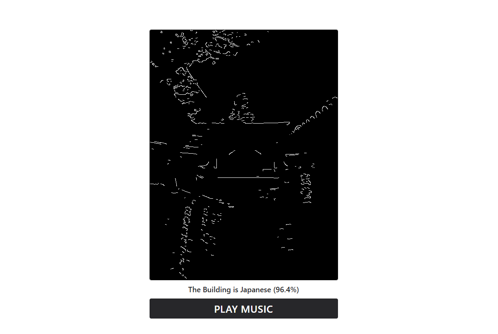

<br/> <div align="center">  </div>

<h1 align="center">Edge-To-Music AI</h1>

<p align="center">
  Transform architecture into sound.<br/>
  Upload a building → AI guesses cultural style → edges become melody → browser performs it in real time.<br/><br/>
  2nd Place • Music & AI Hackathon (Nara, 2025) <br/><br/>
  <a href="https://hackathon-2025-edge-music.vercel.app/"><strong>WEB LINK TO DEMONSTRATION</strong></a>
  &nbsp;·&nbsp;
  <a href="https://github.com/Tenk1Kun/Music-AI-Hackathon">Source Code</a>
</p>

---

## What this project does

This system turns architectural form into a clear, monophonic musical line:

- Upload an image  
- Classify Japan vs Austria style (temple vs chalet)  
- Extract contours using Canny (OpenCV.js / WASM)  
- Map image axes → musical dimensions  
  - **y → pitch**  
  - **x → onset timing**  
  - **edge magnitude → velocity**  
- Play in-browser (Tone.js Transport)  
- Zero backend — privacy-safe, low latency  

> “Architecture is frozen music.” Here, music melts architecture back into sound.

---

## Example Output

<div align="center">
  <br/>
  <i>Temple edges → koto line, 96.4% confidence</i>
</div>

---

## Script Walkthrough of How It Works

Follow the “script” below to understand the full pipeline. Each step mirrors a real module in the repo.

### 1) Load & Normalize (TensorFlow.js)

```ts
// src/util/loadModel.ts
import * as tf from "@tensorflow/tfjs";

let model: tf.LayersModel | null = null;

export const loadKotoModel = async () => {
  if (!model) {
    model = await tf.loadLayersModel("/model/model.json");
  }
  return model;
};
```
```ts
// src/util/preprocessImage.ts
import * as tf from "@tensorflow/tfjs";

export const preprocessImage = async (file: File): Promise<tf.Tensor4D> => {
  // ... FileReader / Image setup ...
  const tensor = tf.tidy(() => {
    const imageTensor = tf.browser.fromPixels(img).toFloat();
    const resized = tf.image.resizeBilinear(imageTensor, [128, 128]);
    const normalized = resized.div(255.0);
    return normalized.expandDims(0) as tf.Tensor4D;
  });
  return tensor;
};
```

### 2) Edge Extraction (OpenCV.js / WASM)

```ts
// src/util/cannyConverter.ts
export const canny = (cv: any, imageIn: RefObject<HTMLCanvasElement | HTMLImageElement>, imageOut?: RefObject<HTMLCanvasElement>) => {
  const src = cv.imread(imageIn.current);
  const gray = new cv.Mat();
  const blurred = new cv.Mat();
  const edges = new cv.Mat();
  const gradX = new cv.Mat();
  const gradY = new cv.Mat();

  cv.cvtColor(src, gray, cv.COLOR_RGBA2GRAY);
  cv.GaussianBlur(gray, blurred, new cv.Size(5, 1), 0);
  cv.Canny(blurred, edges, 350, 450, 3);

  cv.Sobel(gray, gradX, cv.CV_32F, 1, 0, 3);
  cv.Sobel(gray, gradY, cv.CV_32F, 0, 1, 3);

  if (imageOut?.current) cv.imshow(imageOut.current, edges);

  const points: { x:number; y:number; mag:number; theta:number }[] = [];
  for (let y = 0; y < edges.rows; y++) {
    for (let x = 0; x < edges.cols; x++) {
      if (edges.ucharPtr(y, x)[0] !== 0) {
        const gx = gradX.floatAt(y, x);
        const gy = gradY.floatAt(y, x);
        points.push({ x, y, mag: Math.hypot(gx, gy), theta: Math.atan2(gy, gx) });
      }
    }
  }

  // ... delete mats ...
  return points;
};
```

Edges become (x, y, magnitude) points. Magnitude maps to velocity.

### 3) Edges → Events (band/scale mapping)

```ts
// src/util/edgeToEvents.ts
export function mapEdgesToEvents(
  pts, imgW, imgH,
  { lanes, spanSeconds, scaleRootMidi, scaleIntervals, thinCell = 4, velMin = 0.5, velMax = 0.95, yUpIsHigher = true, pitchCurve = 1.3, octaveShift = -1 }
) {
  const taken = new Set<number>();
  const filtered = pts.filter(p => {
    const gx = Math.floor(p.x / thinCell);
    if (taken.has(gx)) return false;
    taken.add(gx);
    return true;
  });

  const laneH = Math.max(1, Math.floor(imgH / lanes));
  let maxMag = 1e-6; for (const p of filtered) maxMag = Math.max(maxMag, p.mag ?? 0);

  const events = filtered.map(p => {
    let laneIdx = Math.floor(p.y / laneH);
    if (yUpIsHigher) laneIdx = (lanes - 1) - laneIdx;

    const lane01  = lanes > 1 ? laneIdx / (lanes - 1) : 0;
    const lane01c = Math.pow(lane01, pitchCurve);
    const curvedIx = Math.round(lane01c * (lanes - 1));

    const degreeIdx = curvedIx % scaleIntervals.length;
    const octave    = Math.floor(curvedIx / scaleIntervals.length) + octaveShift;
    const midi      = scaleRootMidi + scaleIntervals[degreeIdx] + octave * 12;

    const onset    = (p.x / imgW) * spanSeconds;
    const velocity = velMin + (velMax - velMin) * ((p.mag ?? 0.5) / maxMag);

    return { note: `${["C","C#","D","D#","E","F","F#","G","G#","A","A#","B"][midi % 12]}${Math.floor(midi/12)-1}`, onset, velocity, x: p.x, y: p.y };
  });

  return events.sort((a, b) => a.onset - b.onset);
}
```
### 4) Scheduling & Playback (Tone.js)
```ts
// src/util/toneUtil.ts
import * as Tone from "tone";

export async function playEventsAtOnsets(events, style: "Japanese" | "Austrian", { bpm = style === "Japanese" ? 100 : 90, drawDotAt }) {
  Tone.Transport.stop();
  Tone.Transport.cancel();
  Tone.Transport.seconds = 0;
  Tone.Transport.bpm.value = bpm;

  // initChain(style) → returns 'main' (Sampler/PolySynth + FX)
  const { main } = await initChain(style);

  const ids = events.map(ev =>
    Tone.Transport.schedule((time) => {
      (main as any).triggerAttackRelease(ev.note, ev.durSec ?? 0.3, time, ev.velocity);
      if (style === "Japanese" && ev.graceMidi !== undefined) {
        const graceTime = Math.max(Tone.now(), time - 0.05);
        (main as any).triggerAttackRelease(Tone.Frequency(ev.graceMidi, "midi"), 0.06, graceTime, 0.3);
      }
      drawDotAt(ev.x, ev.y);
    }, ev.onset)
  );

  Tone.Transport.start("+0.05");
}
```
Style presets:

Japanese → koto, ~100 BPM, Japanese pentatonic scale (hirajoshi)

Austrian → piano, ~90 BPM, harmonic/minor palette

### 5) Page wiring (where it all connects)

```ts
// src/app/page.tsx (excerpt)
const model = await loadKotoModel();
const tensor = await preprocessImage(file);
const prediction = model.predict(tensor) as tf.Tensor;

const edgePoints = canny(window.cv, imageRef, outputImageRef);
const events = mapEdgesToEvents(edgePoints, imgW, imgH, {
  lanes: 10, spanSeconds: 2, scaleRootMidi: 60, scaleIntervals: [0,2,4,7,9], thinCell: 6
});

await playEventsAtOnsets(events, isJapanese ? "Japanese" : "Austrian", { bpm: isJapanese ? 100 : 90, drawDotAt });
```


## Summary

- Cultural architecture features → musical language  
- Edge geometry as gesture  
- Real-time browser audio AI, zero backend  
- Human-centered sonification  
- Built in 24 hours at an international hackathon 

---

## Built With

- **Next.js + TypeScript** — UI & routing  
- **TensorFlow.js** — style classifier  
- **OpenCV.js (WASM)** — edge detection  
- **Tone.js** — musical engine & scheduling  
- **Vercel** — hosting

---

## Pipeline

<div align="center">
  <br/>
  <i>Full architecture-to-music conversion pipeline</i>
</div>

## Who Uses/Studies This

- Computational creativity researchers  
- AI-music artists  
- Architecture & design students  
- Sonification & HCI explorers  
- Hackathon & WebAudio community

---

**Leon Kattendick**  
- Implemented: `preprocessImage.ts`, `loadModel.ts`, `cannyConverter.ts`, `page.tsx`  
- Led: web visuals / UI integration  
- Also: contributed to `edgeToEvents.ts`  
- GitHub: [LeonKattendick](https://github.com/LeonKattendick)

**Koya Takemura**  
- Trained the classification model  
- Implemented: `toneUtil.ts`  
- Primary author of: `edgeToEvents.ts` (band mapping, scale logic, scheduling interfaces)  
- Integration: end-to-end musical mapping & playback

**Jana**  
- Designed the **SurroundSound** logo

**Steffi**  
- Created and delivered the project **presentation**

**Mungunshagai Tumurbaatar**  
- Contributed **ideas** and **website** support
---

## License

© 2025 Koya Takemura and Contributors. All Rights Reserved.  
